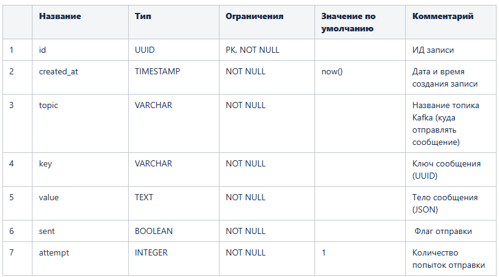
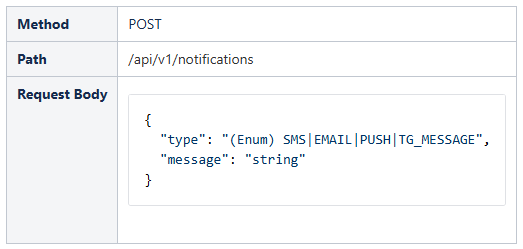
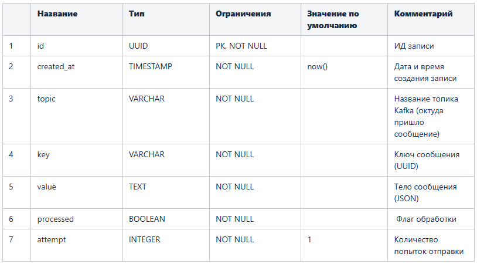

Описание
Реализация системы обработки уведомлений с гарантированной доставкой.

Технологический стек:

Java 21

Spring Boot 3.5.x

Apache Kafka

PostgreSQL

Цель задания:
Разработать систему обработки уведомлений, демонстрирующую:

Работу с Kafka (Producer/Consumer)

Гарантированную доставку сообщений

Идемпотентную обработку

Применение паттернов проектирования

Темы для отработки:

Kafka Producing/Consuming

Реализация гарантированной доставки (Transactional Outbox)

Идемпотентная обработка (Inbox паттерн)

Паттерн "Стратегия" для выбора обработчика

Работа с шедулерами Spring

Конфигурирование приложений

Реализация
Микросервис 1: Request Processor
Структура БД:
notification_outbox (Уведомления для отправки в kafka) - Таблица для хранения отправлемых сообщений в Kafka

notification_outbox

Функционал:
API Endpoint

Логика обработки:

С помощью паттерна проектирования "Стратегия" выбирается обработчик для каждого типа уведомления (в зависимости от значения поля type). Каждый обработчик подготавливает сообщение, которое нужно будет отправить в соответствующий топик Kafka, при этом необходимо реализовать гарантированную доставку сообщения с помощью паттерна Transactional Outbox. Для этого каждый обработчик:

Генерирует UUID ключ для сообщения (для каждого сообщения новый уникальный ключ)
Формирует тело сообщения в JSON

Определяет целевой топик Kafka (для sms - sms-events, для email - email-events, для push - push-events, для TG_MESSAGE - telegram-events)

Сохраняет сообщение в таблицу notification_outbox через Transactional Outbox

Логирует: "Подготовлено сообщение для отправки. Key: <key>, Payload: <body>, topic: <topic>".

Шедулер отправки сообщений:
Шедулер с заданным настраиваемым интервалом должен периодически выбирать неотправленные сообщения и отправлять их в Kafka.

Параметры конфигурации (application.yml):

outbox:
batch-size: 50
delay-ms: 1000
Логика работы:

Выбирает до N (batch-size из конфига) сообщений (where sent = false, сортировка по created_at asc)
Отправляет в Kafka

При успехе обновляет флаг sent = true

При ошибке увеличивает счетчик attempt и пропускает запись

Микросервис 2: Notification Service
Структура БД:
sms_inbox (Сообщения из sms-events) -  Таблица для хранения входящих сообщений из топика sms-events

sms_inbox

Аналогичную структуру имеют следующие таблицы:

email_inbox
push_inbox
telegram_inbox
Функционал:
Kafka Consumers
Отдельный Listener для каждого топика:

sms-events

email-events

push-events

telegram-events

Каждый Listener:

Проверяет уникальность сообщения (по key+value)

Сохраняет в соответствующую таблицу inbox

При дубликате - пропускает обработку

Шедулер обработки сообщений:
Для каждой таблицы inbox отдельный шедулер с заданным настраиваемым интервалом выбирает полученные сообщения для последующей обработки.

Параметры конфигурации (application.yml):

inbox:
batch-size: 50
delay-ms: 1000
Логика работы:

Выбирает до N (batch-size из конфига) сообщений (where processed = false, сортировка по created_at asc)
Логирует сообщение "Обработано событие: Key: <key>, Payload: <body>, topic: <topic>"

Обновляет флаг processed = true

При ошибке увеличивает счетчик attempt и пропускает запись

Алгоритм действий
Создание локальных репозиториев.
Создать два Maven-проекта локально для каждого из сервисов, используя версии Java и Spring Boot, описанные выше.

request-processor
notification-service
Создать ветку master, выполнить initial commit (базовая структура проекта, pom.xml).